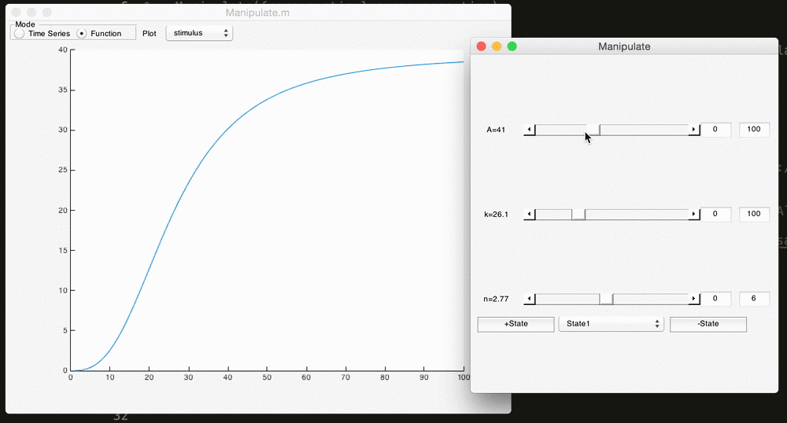
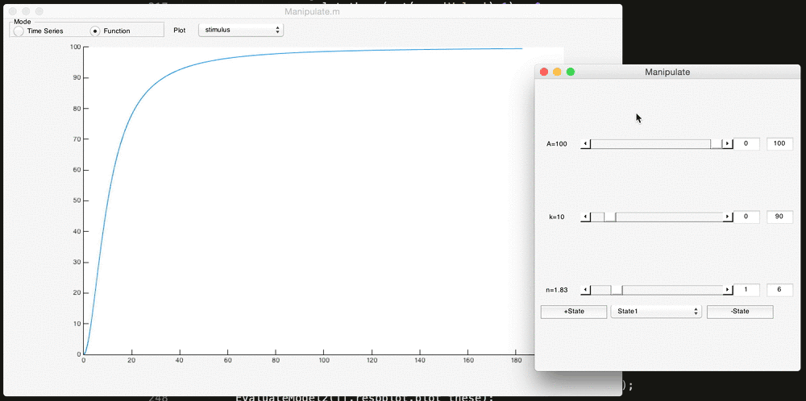

# Manipulate.m

Mathematica-style model and function manipulation in MATLAB.

## Function Manipulation 

Manipulate can work with any function in the form `[a,b,c...] = function(p,x)` where p is a structure array containing parameters. 

Here, we can manipulate the [Hill](https://github.com/sg-s/srinivas.gs_mtools/blob/master/hill.m) function using:

```matlab
Manipulate('hill',[],[1:100]);
```


* The function is updated while we move the sliders around, not just when we drop it
* you can change the bounds easily to adjust how sensitive the sliders are
* Manipulate automatically read the function file and figured out what the parameters were. This magic is due to [getModelParameters.m](https://github.com/sg-s/srinivas.gs_mtools/blob/master/getModelParameters.m)

## Model manipulation 

Manipulate can also work with models in the form `[a,b,c...] = function(p,x)` where p is a structure array containing parameters. 

```
Manipulate('hill',[],x)
```

allows us to:



* the model can have any number of outputs. Manipulate will allow you to plot all of them if you wish. This works because Manipulate reads your function file and determines how many outputs there are. 

## More sophisticated manipulation 

### Specify a parameter structure

### Compare model outputs to a target

### Manipulate simulations 

## Installation 

Install using my package manager:

```matlab
urlwrite('http://srinivas.gs/install.m','install.m')
install manipulate
install srinivas.gs_mtools % Manipulate needs this to work
```

Manipulate needs MATLAB R2014b or later.

## Known bugs and limitations

1. Manipulate window does not close when manipulating external models. That's because the external model file doesn't know about the existence of Manipulate. 
3. Manipulate will not work with functions defined as `[varargout] = foo(varargin)`